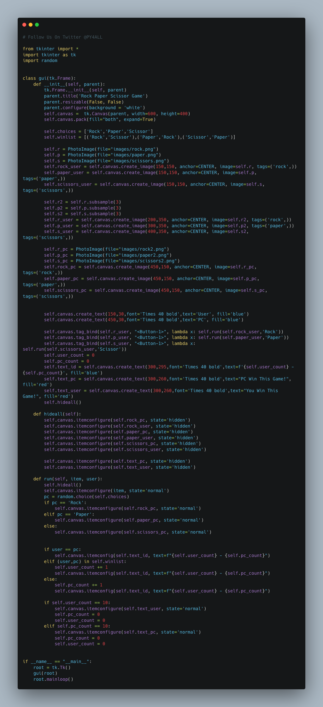
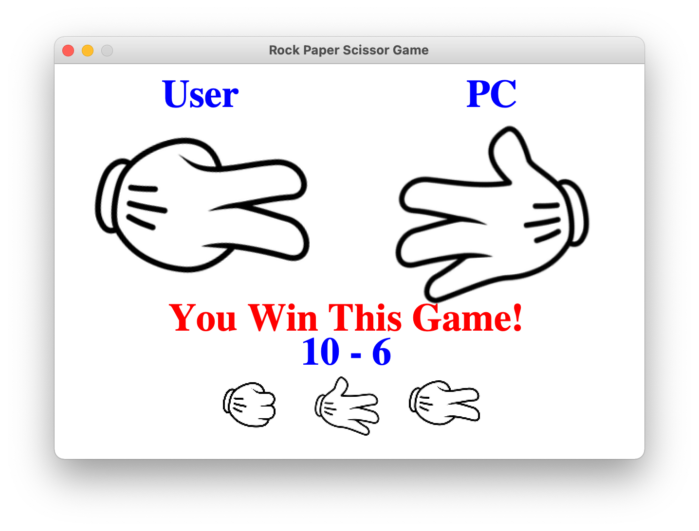

# Rock_Paper_Scissors
Rock Paper Scissors Game - Python Tkinter GUI



## This is a Rock Paper Scissors Game.

#### The modules Used to make this script are:-

        -tkinter
        -random

This is a GUI based python script.

## Install

Python Code On windows machine:

clone Rock_Paper_Scissors repository on local machine.
```

> git clone https://github.com/geosaleh/Rock_Paper_Scissors

```
change directory to SudokuSolver
```

> cd Rock_Paper_Scissors/

```

Now its time to execute **main_gui.py**
```

> python main_gui.py

```
it will show following Output


## Download
:paperclip: [Download Here](https://github.com/geosaleh/Rock_Paper_Scissors/archive/refs/heads/main.zip)

Hope you'll install it in your computer just to try .


```
